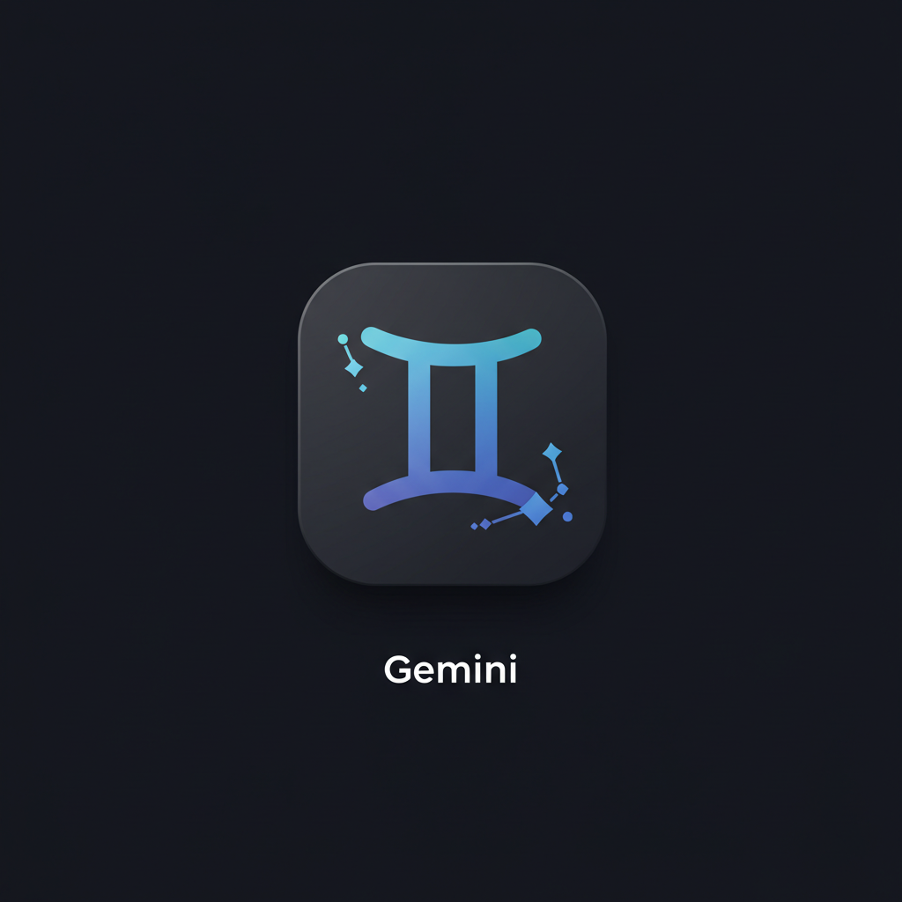

# GemChat

[中文](README.md) | English

A Gemini AI chat application developed with Flutter, providing a clean, beautiful interface and rich features.



## Features

- 🤖 Integrated with Gemini AI model, supporting intelligent conversations
- 💬 Multiple chat session management, easily switch between different conversations
- 🌓 Support for light/dark theme switching
- 🔄 Multiple Gemini models available
  - gemini-2.0-pro-exp-02-05
  - gemini-2.0-flash-thinking-exp-01-21
  - gemini-2.0-flash-001
- 📋 Markdown format support, beautifully displaying AI replies
- 🔑 API key management, secure and convenient

## Requirements

- Flutter SDK ^3.7.0
- Dart SDK ^3.7.0
- Android/iOS/Web/Windows/macOS/Linux platform support

## Getting Started

### 1. Get the code

```bash
git clone https://github.com/zym9863/gemchat.git
cd gemchat
```

### 2. Install dependencies

```bash
flutter pub get
```

### 3. Run the application

```bash
flutter run
```

### 4. Set up API key

When starting the application for the first time, you need to set up a Gemini API key. You can obtain an API key from Google AI Studio.

## Project Structure

```
lib/
├── main.dart              # Application entry
├── models/                # Data models
│   ├── chat_message.dart  # Chat message model
│   └── chat_session.dart  # Chat session model
├── providers/             # State management
│   └── chat_provider.dart # Chat state provider
├── screens/               # Screens
│   ├── api_key_screen.dart # API key setting screen
│   └── chat_screen.dart   # Main chat screen
├── services/              # Services
│   └── gemini_service.dart # Gemini API service
└── theme/                 # Theme
    └── app_theme.dart     # Application theme settings
```

## Main Dependencies

- provider: ^6.1.2 - State management
- http: ^1.3.0 - Network requests
- shared_preferences: ^2.5.2 - Local storage
- flutter_markdown: ^0.7.6+2 - Markdown rendering
- file_picker: ^9.0.2 - File selection

## Contribution Guidelines

Issues and feature requests are welcome! If you want to contribute code, please follow these steps:

1. Fork the project
2. Create your feature branch (`git checkout -b feature/amazing-feature`)
3. Commit your changes (`git commit -m 'Add some amazing feature'`)
4. Push to the branch (`git push origin feature/amazing-feature`)
5. Open a Pull Request

## License

[MIT License](LICENSE)